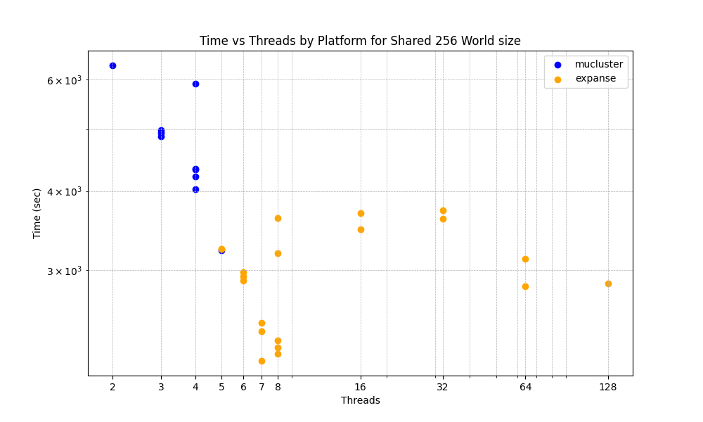

# Project 2 Analysis

## Introduction  

In this analysis, we explore the performance of two parallelized programs under varying conditions: the number of threads/processes and the size of the world. We aim to assess the speedup, efficiency, and crossover points of the programs.

## Experimental Setup

* Programs: Two parallelized programs.
* Variables: Number of threads/processes, size of the world.
* Worlds: Large, pre-populated worlds.
* Data Generation: Additional worlds created by iterating basic.txt and using the output as input for subsequent runs.

We realized that the better count of thread will have a expental speed up (inceases).
This is becasue more threads allows for more opration to be processed reducing the overall time required for execution. However, it's important to note that this speed-up only occurs up to a point. Once the optimal number of threads for the system has been reached, adding more threads can actually decrease performance due to the overhead associated with managing and scheduling these threads.

The collected data showed that with an increase of threads for the distibuted program the speed up had an exponetial increase in performance but this was not reflected in the shared program where the number of threads gave an increase in performance when going from two to eight threads but going past eight threads led to a decrease in performance. The point where the thread count seemed to be ideal for this data set when using the shared program is eight threads. 

## Results
### Speedup and Efficiency

* Speedup and efficiency graphs for different thread/process counts and world sizes.
* Analysis of trends and optimal configurations.

## Crossover Points

* Identification of crossover points where programs exhibit different ranks.
* Discussion on factors influencing crossover points, such as workload distribution and synchronization overhead.

## Impact of World Size
* How performance varies with increasing world size.
* Insight into scalability and resource utilization.

## Conclusion

* Summary of findings, including optimal configurations and performance characteristics.
* Recommendations for optimizing program performance based on analysis results.

