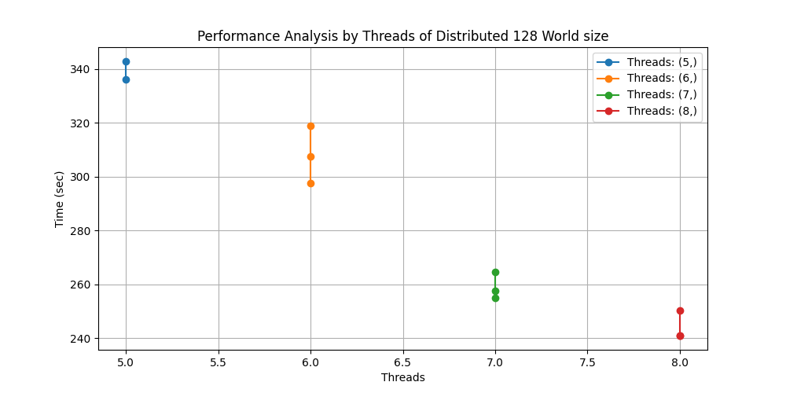

# Project 2 Analysis

## Introduction  

In this analysis, we explore the performance of two parallelized programs under varying conditions: the number of threads/processes and the size of the world. We aim to assess the speedup, efficiency, and crossover points of the programs.

## Experimental Setup

* Programs: Two parallelized programs.
* Variables: Number of threads/processes, size of the world.
* Worlds: Large, pre-populated worlds.
* Data Generation: Additional worlds created by iterating basic.txt and using the output as input for subsequent runs.

## Results
### Speedup and Efficiency

* Speedup and efficiency graphs for different thread/process counts and world sizes.
* Analysis of trends and optimal configurations.

## Crossover Points

* Identification of crossover points where programs exhibit different ranks.
* Discussion on factors influencing crossover points, such as workload distribution and synchronization overhead.

## Impact of World Size
* How performance varies with increasing world size.
* Insight into scalability and resource utilization.

## Conclusion

* Summary of findings, including optimal configurations and performance characteristics.
* Recommendations for optimizing program performance based on analysis results.

